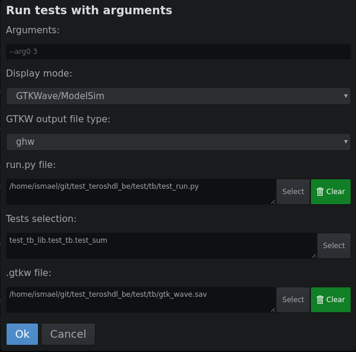
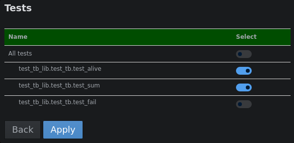

# User manual

## Introduction

The idea is that the toolbar has the main functionalities. Each of them is represented as an icon.

This is a representation of the IDE workflow from left to right.

1. Create repository
2. Create files/testbench.
3. Create Vunit file.
4. Run test.
5. Document design.

## Create repository

Add files or creates a repository estructure with an example design.

## Create component

Put the mouse inside an VHDL entity and click the button. This will copy to clipboard a component estructure of the entity.

## Create instance

Put the mouse inside an VHDL entity and click the button. This will copy to clipboard an instance of the entity.

## Create signals

Put the mouse inside an VHDL entity and click the button. This will copy to clipboard the signals of the entity ports.

## Create testbench

Put the mouse inside an VHDL entity and click the button. This will copy to clipboard a template to create a testbench of the entity with Vunit framework.
If AXI lite is being used the testbench will include code to test the bus with UVVM libraries.

## Create run.py

This will open a dialog to select the source files and the testbench files. You can also select the location of the file, the name and to include libraries for simulation.
You can also mark other checks if you wish to modify the python file manually and add more complex test.

## Code structure

This button open or close the structure view panel.

## Run.py arguments configuration

Here you can configure some things about run.py:
1. Add custom arguments to be executed each time the run test button is pressed.
2. Select the run.py file for run test button
3. Select which test should be executed.
4. Select the oputput of the test Terminal or waveform.
5. Select the waveform file to be opened automatically to view the results.

## Run test

This is the button used to run the test in your design with the previous configuration.

## Stop test

If you wish to cancel the a launched test you can use this button.

## Recompile

Sometimes you need to recompile the whole design, it can be done that with this button.

## Browse code coverage report

Take into acount that the code coverage is the sum of all the test run

## Switch simulator.

Switch between simulators just pressing this button.

## Symbolator view.

Here you can create an image of the inputs and outputs of the module. You just need to put the cursor selecting the component of a module you want to draw.

## Copy as doc.

With this button you will get a port table in markdown format of an entity of your choice.

| Port name | Type                          | Description |
| --------- | ----------------------------- | ----------- |
| clk       | std_logic                     |   N/A       |
| reset     | std_logic                     |   N/A       |
| in_1      | std_logic_vector (4 downto 0) |   N/A       |
| in_2      | std_logic_vector (4 downto 0) |   N/A       |
| in_3      | std_logic_vector (4 downto 0) |   N/A       |
| sum       | std_logic_vector (7 downto 0) |   N/A       |

## Link to this manual.

You will be redirected to the last versión of the manual. Make sure it matches with your TerosHDL version.

## Toggle console.

Pressing this button you can show or hide the console panel.
